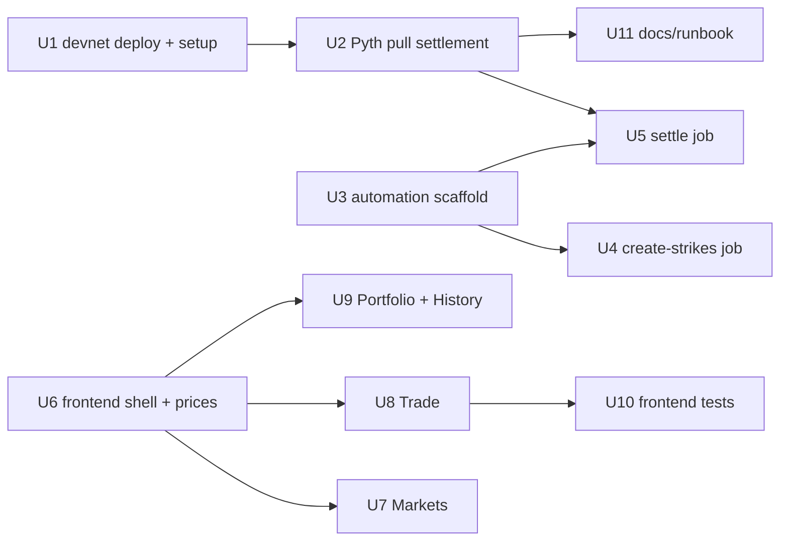

# feat: Complete Meridian to a PRD-Passing Submission

Close every remaining gap between the current repo and the Peak6 PRD
(`PRD - Peak6.md`) so the project passes: a non-custodial MAG7 binary-options
dApp **deployed and demonstrable on Solana devnet**, with the full 5-page
frontend, the daily automation service, real Pyth-oracle settlement (with an
admin-override fallback), tests, and one-command setup.

The on-chain program is essentially done (all instructions, $1 invariant, 39
unit + 111 LiteSVM + 100K Trident tests). A minimal test-harness frontend exists
in `app/`. This plan builds the product layers around that core.

---

## Problem Frame

The PRD's pass/fail bar (PRD §"Required: Testnet Deployment", lines 51/354) is a
**full system running on Solana devnet** with reproducible scripts and a
one-command setup, demonstrating create → mint → trade → settle → redeem. Three
PRD deliverables are missing or stubbed:

1. **Devnet deployment** — nothing is deployed; only a local validator. The
   actual deploy is human-gated on ~8 SOL of devnet rent.
2. **The real frontend** — the PRD specifies 5 pages (Landing, Markets, Trade,
   Portfolio, History) with the four Buy/Sell-Yes/No trade paths, both-perspective
   order book, position constraints, live prices, settlement countdown, and P&L.
   `app/` currently has a single-market test harness (~20% of that).
3. **The automation service** — the daily create-strikes and settle jobs don't
   exist; markets are created one at a time by a script.

This plan delivers all three plus the supporting oracle, tests, and docs.

---

## Oracle Feasibility Finding (resolved during planning)

Real on-chain oracle settlement on devnet **is feasible** via the Pyth pull
oracle: MAG7 US-equity feeds (`Equity.US.<TICKER>/USD`) are served by Hermes,
and `@pythnetwork/pyth-solana-receiver` posts a `PriceUpdateV2` to devnet under
the canonical receiver (`rec5EKMGg6MxZYaMdyBfgwp4d5rB9T1VQH5pJv5LtFJ`, already
in `Config.pyth_receiver`). Constraints that shape U2/U5:

- **Equity feeds are only fresh during US market hours** (9:30AM–4PM ET,
  weekdays). Off-hours, the regular-session feed is stale → fall back to the
  admin-override settle path (PRD §"Admin Settle (Override)").
- **`settle_market` pins the price to `[expiry, expiry+30s]`** — demo-shaped.
  Real settlement (post ~4:05PM for a 4:00PM expiry) lands outside that window.
  U2 must reconcile this (widen the window / change the freshness model), a small
  contract change requiring a redeploy (safe — nothing deployed yet).
- **Hermes access**: the public `hermes.pyth.network` endpoint is moving to an
  API-key model (mid-2026). Treat the endpoint as configurable; document the key
  dependency.

---

## Key Technical Decisions

- **Settlement: real Pyth pull on devnet, admin-override as documented fallback.**
  Satisfies "settle via oracle on devnet" while honoring market-hours reality.
- **Live UI prices: Pyth Hermes client-side** (`HermesClient`, `/v2/updates/price/latest`
  or SSE stream), same equity feed IDs as settlement. Endpoint configurable via env.
- **Position constraints are UI-enforced** (PRD §144): the Trade page checks the
  wallet's Yes/No balances and blocks/guides; no on-chain change. Holding both
  Yes and No is only transient during mint-pair.
- **Four trade paths map to existing instructions** — Buy Yes = taker bid
  (`place_market_order`/`place_limit_order`), Sell Yes = taker ask, Buy No =
  `buy_no` (atomic mint+sell-Yes), Sell No = `sell_no` (atomic buy-Yes+burn).
  Single wallet approval each, as the PRD requires.
- **Reuse `app/` foundations** — Anchor client (`program.ts`), in-memory IDL
  patch (`idlPatch.ts`), read layer (`market.ts`), `matching.ts`, `actions.ts`,
  `MeridianContext`. The frontend units extend these, not rewrite.
- **`Add Strike` = `create_strike_market` with a new strike** (per-strike PDA).
  Treated as satisfied; the per-market `pyth_feed_id` satisfies "oracle feed
  references." A `Config` ticker registry is deferred (avoids a layout change).
- **Automation lives in `automation/`** (TypeScript/Node, same repo), sharing
  PDA/feed config with the frontend via a small shared module or duplication kept
  intentionally thin.
- **Demo runs a subset of MAG7 by default** for speed; config supports all 7.

---

## System-Wide Impact

- **End users**: gain a real trading UI (5 pages) on devnet.
- **Operators**: gain the automation service + a devnet runbook.
- **The program**: one likely small change (settle freshness window, U2) →
  redeploy. Account layouts otherwise unchanged.
- **Repo shape**: new top-level `automation/`; `app/` expands; new `Makefile` +
  devnet scripts; README rewrite.

---

## Output Structure

```
Makefile                      # make dev / make devnet-deploy / make demo
automation/
  package.json
  src/
    config.ts                 # 7 tickers, feed IDs, strike spacing, RPC/keypair
    client.ts                 # shared Anchor program client + PDA helpers
    pyth.ts                   # Hermes fetch + receiver post (PriceUpdateV2)
    jobs/createStrikes.ts     # morning job
    jobs/settle.ts            # settlement job (+ admin-override fallback)
    log.ts                    # structured logging + alert hook
    index.ts                  # CLI entry: `create-strikes` | `settle`
app/src/
  app/
    page.tsx                  # Landing
    markets/page.tsx          # Markets (MAG7 grid)
    trade/[market]/page.tsx   # Trade (book + 4 paths + constraints + countdown)
    portfolio/page.tsx        # Portfolio (positions, P&L, redeem)
    history/page.tsx          # History (trade log)
  components/                 # nav, MarketCard, BothSidesBook, TradePanel,
                              # PositionGuard, Countdown, Payoff, PnL, ...
  lib/
    prices.ts                 # Pyth Hermes live-price client/hook
    tradePaths.ts             # Buy/Sell Yes/No → instruction mapping
    pnl.ts                    # P&L computation
docs/
  ARCHITECTURE.md             # design + trade-offs + known limitations
  DEVNET-RUNBOOK.md           # deploy + demo on devnet
```

---

## Implementation Units

Phased: **A** devnet+oracle (the pass bar), **B** automation, **C** frontend,
**D** tests+docs. Dependency graph:



### U1. Devnet deploy + one-command setup

**Goal:** Make the full system deploy and run on devnet reproducibly, with a
one-command local setup (PRD §358 "make dev or equivalent").

**Requirements:** PRD §51, §354–358 (testnet deployment + reproducible scripts +
one-command setup).

**Dependencies:** none.

**Files:** `Makefile`, `scripts/deploy-devnet.sh`, `scripts/devnet-lifecycle.sh`,
`scripts/README.md` (update), `app/.env.local.example` (devnet values comment),
`README.md` (root, one-command setup).

**Approach:** `Makefile` targets: `make dev` (start local validator + bootstrap +
`app` dev server), `make devnet-deploy` (`anchor deploy --provider.cluster devnet`,
idempotent; preflight checks wallet balance and prints the fund-this-address
message if under ~8 SOL), `make demo` (run the devnet lifecycle script). Deploy
is **one command once the wallet is funded** — the ~8 SOL funding is a documented
human step (faucet/transfer). Reuse `bootstrap-devnet.mjs`.

**Patterns to follow:** `scripts/settle-redeem-demo.sh`, `scripts/bootstrap-devnet.mjs`,
`Anchor.toml` ([provider] cluster=devnet).

**Test scenarios:**
- `make dev` on a clean checkout brings up validator + bootstrapped config + app.
- `make devnet-deploy` with an underfunded wallet exits with a clear "fund
  `7sYc…`" message and the exact SOL shortfall (no partial deploy).
- `make devnet-deploy` with a funded wallet deploys and `solana program show`
  confirms the program is invokable.
- The devnet lifecycle script runs create→mint→trade end-to-end against devnet
  and exits non-zero on any step failure.

**Verification:** From a clean clone, `make dev` works locally; with a funded
devnet wallet, `make devnet-deploy && make demo` deploys and demonstrates the
lifecycle on devnet.

### U2. Pyth pull-oracle settlement on devnet

**Goal:** Real oracle settlement on devnet — fetch a MAG7 equity update from
Hermes, post it via the receiver, and `settle_market`; reconcile the freshness
window; keep admin-override as fallback.

**Requirements:** PRD §264 (Settle Market, oracle freshness + confidence), §289–293
(oracle integration), §354–356 (full lifecycle incl. settle on devnet).

**Dependencies:** U1.

**Files:** `scripts/post-pyth-update.mjs` (or `automation/src/pyth.ts` shared),
`scripts/devnet-lifecycle.sh` (extend to settle+redeem), and **likely**
`programs/meridian/src/instructions/settle_market.rs` (+ a redeploy) to widen the
`[expiry, expiry+30s]` price-time window, plus its LiteSVM coverage in
`tests/litesvm/tests/u7_settle_redeem.rs`.

**Approach:** Use `@pythnetwork/pyth-solana-receiver` + `HermesClient` to fetch
the price update for the market's `pyth_feed_id`, post it (creating a
`PriceUpdateV2`), then call `settle_market` referencing that account. **Decision
to resolve in execution:** the current window pins settlement to
`[expiry, expiry+30s]`; for real settlement (posted minutes after a 4PM expiry)
this must widen to a configurable post-expiry settlement window (e.g.
`[expiry, expiry + SETTLE_WINDOW]` with staleness still enforced relative to
`publish_time`). If feed is stale/closed, document and use `admin_settle_market`.

**Execution note:** If the settle-window contract change is needed, add the
failing LiteSVM case (post-expiry-by-minutes price update settles) before
changing `settle_market`.

**Patterns to follow:** `scripts/forge-pyth-account.mjs` (what a PriceUpdateV2
looks like), `settle-redeem-demo.sh` (settle flow shape), `settle_market.rs`
freshness/confidence logic, `Config.pyth_receiver`.

**Test scenarios:**
- LiteSVM: a price update with `publish_time` minutes after expiry (but within the
  new window) settles successfully; one outside the window is rejected.
- LiteSVM: stale price (older than staleness threshold) rejected; wide-confidence
  price rejected (existing coverage preserved).
- Script: posting a real Hermes equity update to devnet creates a receiver-owned
  `PriceUpdateV2` and `settle_market` stamps the correct outcome.
- Fallback: when no fresh feed, `admin_settle_market` (after its grace) settles and
  `redeem` pays the winner 1:1.

**Verification:** On devnet during market hours, the lifecycle script settles a
market from a real Pyth equity price and redeems; off-hours, the admin-override
fallback settles and redeems.

### U3. Automation service scaffold

**Goal:** A TypeScript/Node service in `automation/` with shared config, Anchor
client, Pyth helper, logging, and a CLI entry — the foundation for both jobs.

**Requirements:** PRD §314–321 (automation service, same repo).

**Dependencies:** none (can proceed parallel to A; shares `pyth.ts` concept with U2).

**Files:** `automation/package.json`, `automation/src/config.ts`,
`automation/src/client.ts`, `automation/src/pyth.ts`, `automation/src/log.ts`,
`automation/src/index.ts`, `automation/README.md`.

**Approach:** `config.ts` holds the 7 tickers, their Pyth feed IDs, strike-spacing
rules, RPC URL, and admin keypair path (env-driven). `client.ts` builds the Anchor
program + PDA helpers (mirror `app/src/lib/pdas.ts`). `pyth.ts` = Hermes fetch +
receiver post (shared with U2). `index.ts` exposes `create-strikes` and `settle`
subcommands for cron/manual runs. Structured logging + an `alert()` seam (stderr
+ optional webhook).

**Patterns to follow:** `scripts/bootstrap-devnet.mjs` (Anchor-from-IDL in Node),
`app/src/lib/pdas.ts`, `app/src/lib/idlPatch.ts` (the Book IDL patch is also
needed here if the service reads the book).

**Test scenarios:**
- `config.ts` validates: rejects a ticker with no feed ID; strike spacing produces
  sane strikes around a sample price.
- `client.ts` builds a program whose `programId` matches the IDL and can fetch
  `Config` from a running cluster (guarded integration test).

**Verification:** `automation/` builds and `node ... index.ts --help` lists both
jobs; a smoke run connects to a cluster and reads `Config`.

### U4. Morning create-strikes job

**Goal:** For each configured stock, read the reference price, compute strikes,
and `create_strike_market` for each — idempotent, with retry/backoff.

**Requirements:** PRD §261–262 (Create Strike / Add Strike), §318 (morning job).

**Dependencies:** U3.

**Files:** `automation/src/jobs/createStrikes.ts`,
`automation/test/createStrikes.test.ts`.

**Approach:** Read previous close per ticker from Hermes (or a configured price
source — off-chain read is allowed per PRD §292), compute the strike set, derive
each market PDA, skip markets that already exist (idempotent), `create_strike_market`
the rest. Retry with backoff; log per-ticker results; `alert()` on persistent
failure.

**Test scenarios:**
- Strike computation: given a sample close, produces the expected strike ladder.
- Idempotency: re-running with an existing market for `(ticker, strike, expiry)`
  skips it (no `AccountAlreadyInitialized` crash).
- Partial failure: one ticker's create failing doesn't abort the others; the
  failure is logged + alerted.
- Integration (guarded, local validator): creates N markets; a second run is a
  no-op.

**Verification:** Running the morning job against a local/devnet cluster creates
the day's markets and is safe to re-run.

### U5. Settlement job (+ admin-override fallback)

**Goal:** After close, settle every open market via the Pyth pull oracle, with
retry and an admin-override fallback on oracle failure.

**Requirements:** PRD §264–265, §293, §319 (settlement job, retry, override).

**Dependencies:** U3, U2 (uses the post-update + window logic).

**Files:** `automation/src/jobs/settle.ts`, `automation/test/settle.test.ts`.

**Approach:** Enumerate open (unsettled, past-expiry) markets, post the Pyth
update + `settle_market` for each. Retry every ~30s up to ~15min on
stale/wide-confidence (PRD §319). If still failing past the override grace,
call `admin_settle_market` with the operator-supplied price and alert. Then
optionally run `settle_sweep` to refund resting orders.

**Test scenarios:**
- Happy path (mocked Hermes + local validator): open market settles to the
  correct outcome from a posted price.
- Retry: transient Hermes failure retries, then succeeds.
- Override: after max retries, the job invokes `admin_settle_market` and alerts.
- Idempotency: an already-settled market is skipped (no `MarketSettled` crash).

**Verification:** Against a local cluster with a forged/real feed, the job settles
open markets; with the feed forced to fail, it falls back to override.

### U6. Frontend shell: routing, nav, Landing, live prices

**Goal:** Multi-page App-Router shell (Landing + nav across Markets/Trade/Portfolio/
History) and a live Pyth Hermes price hook the pages share.

**Requirements:** PRD §299 (Landing), §305–311 (live prices, payoff display).

**Dependencies:** none beyond existing `app/` (reuses `MeridianContext`, `program.ts`).

**Files:** `app/src/app/page.tsx` (Landing — replaces the harness page),
`app/src/app/layout.tsx` (nav), `app/src/components/Nav.tsx`,
`app/src/lib/prices.ts` (Hermes client + `usePrices` hook),
`app/src/components/Payoff.tsx`, `app/src/lib/feeds.ts` (ticker→feed-ID map).

**Approach:** Move the current single-page harness content out; Landing explains
the product, shows live MAG7 prices (via `usePrices`), and a connect CTA. `prices.ts`
wraps `HermesClient` (endpoint from `NEXT_PUBLIC_HERMES_URL`), polling or SSE,
exposing `{ticker: {price, confidence, publishTime}}`. Nav links the 5 pages.

**Patterns to follow:** existing `providers.tsx`, `MeridianContext`, `format.ts`.

**Test scenarios:**
- `usePrices` parses a Hermes response into per-ticker price/confidence; tolerates
  a missing feed (returns null, no throw).
- Landing renders without a wallet and shows the connect CTA; nav routes to each page.
- `Payoff` renders "You pay $X, win $1.00 if [STOCK] above [STRIKE]" for sample inputs.

**Verification:** App boots, Landing shows live prices, and all five routes load.

### U7. Markets page (MAG7 grid)

**Goal:** Grid of the 7 stocks with live prices and active contract counts; cards
link into Trade.

**Requirements:** PRD §300 (Markets), §307 (contract cards, implied probability).

**Dependencies:** U6.

**Files:** `app/src/app/markets/page.tsx`, `app/src/components/MarketCard.tsx`,
`app/src/components/StockTile.tsx`.

**Approach:** Group on-chain markets (`listMarkets`) by ticker; per stock show the
live price and count of active strikes. Per-strike card shows strike, current
Yes/No mid (from the book), and implied probability (Yes price / $1). Reuse the
read layer; live price from `usePrices`.

**Test scenarios:**
- Grouping: a mixed market list buckets correctly by ticker; stocks with no
  markets still render with a price and "no active contracts".
- Implied probability: a Yes mid of 0.62 renders ~62%.
- Card links to the correct `trade/[market]` route.

**Verification:** Markets page shows all 7 tiles with live prices and the right
active-contract counts; clicking a card opens Trade for that market.

### U8. Trade page: both-perspective book, 4 trade paths, position constraints, countdown

**Goal:** The core trading screen — order book shown from **both Yes and No
perspectives** of the same book, the four Buy/Sell Yes/No paths with **position
constraints**, settlement countdown, and payoff display.

**Requirements:** PRD §301, §308–311 (both-perspective book, 4 paths,
position-aware constraints, countdown, payoff), §142–144 (no holding both Yes+No
from trading).

**Dependencies:** U6 (reuses `matching.ts`, `actions.ts`, `OrderBook`).

**Files:** `app/src/app/trade/[market]/page.tsx`,
`app/src/components/BothSidesBook.tsx`, `app/src/components/TradePanel.tsx`,
`app/src/components/PositionGuard.tsx`, `app/src/components/Countdown.tsx`,
`app/src/lib/tradePaths.ts`, `app/src/lib/tradePaths.test.ts`.

**Approach:** `tradePaths.ts` maps Buy Yes → taker bid, Sell Yes → taker ask
(`place_market_order`/`place_limit_order`), Buy No → `buy_no`, Sell No → `sell_no`
— each a single approval. `BothSidesBook` renders the one book as two views (No
price = $1 − Yes price). `PositionGuard` reads balances: if holding No, disable
Buy Yes and prompt "sell No first" (and vice versa) per PRD §142–144. `Countdown`
ticks to the market's 4PM ET expiry. Reuse `matching.ts` for crossing/remaining
accounts and `actions.ts` for the calls (extend with `buyNo`/`sellNo` actions).

**Technical design (directional, not spec):** No-perspective price = `1 − yesPrice`;
a "Buy No @ p" maps to the program's `buy_no` with the equivalent Yes-leg bound.
Confirm the exact price mapping against `buy_no.rs`/`sell_no.rs` during execution.

**Execution note:** Build `tradePaths.ts` test-first — the Yes/No price mapping and
path→instruction routing is the error-prone core.

**Test scenarios:**
- `tradePaths`: each of the 4 paths routes to the right instruction with correct
  args; No-side price maps to `1 − yesPrice`.
- Position constraint: holding No disables Buy Yes with the "sell No first" prompt;
  holding neither allows both; transient both-held (mid mint-pair) handled.
- Both-sides book: a single resting Yes ask renders correctly in both the Yes and
  No views.
- Countdown: renders time-to-4PM-ET and a "closed" state past expiry.
- (Integration, live validator, multi-wallet) Buy No then Sell No round-trips
  through `buy_no`/`sell_no` and balances reconcile.

**Verification:** On a live market, all four paths execute with one approval each,
the book shows both perspectives, position constraints block the disallowed path,
and the countdown is correct.

### U9. Portfolio + History pages

**Goal:** Portfolio (active positions, settled outcomes, P&L, redeem) and History
(trade execution log).

**Requirements:** PRD §302–303 (Portfolio, History), §312 (entry price, P&L, redeem).

**Dependencies:** U6.

**Files:** `app/src/app/portfolio/page.tsx`, `app/src/app/history/page.tsx`,
`app/src/components/PositionRow.tsx`, `app/src/lib/pnl.ts`,
`app/src/lib/pnl.test.ts`, `app/src/lib/history.ts`.

**Approach:** Portfolio enumerates the wallet's Yes/No holdings across markets,
shows current value (from book mid / live price), P&L vs a tracked entry basis,
and a redeem button on settled markets (reuse the redeem action). History reads
the wallet's program transactions (parse instruction types / events) into a log.
P&L basis: derive entry from history where possible; document the approximation.

**Test scenarios:**
- `pnl`: given entry and current prices, computes P&L and % correctly; settled
  winner/loser values resolve to $1/$0.
- Portfolio lists only markets where the wallet holds tokens; redeem shows only on
  settled markets.
- History parses a known tx into the right log entry (mint/trade/cancel/redeem).

**Verification:** After trading on a market, Portfolio shows the position and P&L;
after settlement, redeem pays out and History shows the executions.

### U10. Frontend + multi-user tests

**Goal:** The PRD-listed frontend tests and a multi-user integration scenario.

**Requirements:** PRD §340–348 (frontend tests), §338 (multi-user scenario).

**Dependencies:** U8, U9.

**Files:** `app/src/lib/tradePaths.test.ts`, `app/src/lib/pnl.test.ts` (from U8/U9),
`app/src/lib/multiuser.live.test.ts`, plus component-level tests as needed.

**Approach:** Pure tests for trade-path routing, price mapping, P&L, position-
constraint logic. A guarded multi-user live test: wallet A mints + quotes (rests
orders), wallet B takes; both end with reconciled balances and can redeem after
settlement — mirrors PRD §338 and the existing `place.live.test.ts` pattern
(serialized via `fileParallelism: false`).

**Test scenarios:** (this unit *is* tests — see U8/U9 scenarios plus:)
- Multi-user: A rests an ask, B crosses it from a second funded keypair; A's USDC
  and B's Yes reconcile; both redeem the winner after settlement.

**Verification:** `cd app && npm test` is green incl. the multi-user scenario when
a validator is up; logic tests pass offline.

### U11. Docs: README, architecture/trade-offs, devnet runbook

**Goal:** One-command-setup README, an architecture/trade-offs/limitations doc, and
a devnet runbook (PRD §358, §368 "documented trade-offs").

**Requirements:** PRD §358 (clear README, one-command setup), §368 (defensible
trade-offs documented), §354–356 (reproducible devnet scripts).

**Dependencies:** U1 (commands), U2 (oracle story).

**Files:** `README.md` (root rewrite), `docs/ARCHITECTURE.md`,
`docs/DEVNET-RUNBOOK.md`, `app/README.md` (update for the 5 pages).

**Approach:** README: what it is, one-command `make dev`, the devnet deploy steps
(incl. the funding requirement), test commands. ARCHITECTURE: matching-engine
design, the build-own-CLOB decision, the IDL-patch workaround, the settle-window
reconciliation, the market-hours/oracle limitation, position-constraint-in-UI
choice, known limitations. RUNBOOK: fund → deploy → bootstrap → run automation →
demo lifecycle on devnet.

**Test scenarios:** `Test expectation: none — documentation.` (Verify by following
the README's one-command setup on a clean checkout.)

**Verification:** A new reader can deploy to devnet and run the lifecycle by
following the README/runbook alone.

---

## Risks & Mitigations

- **Devnet funding (~8 SOL) is external and faucet-limited** — the hard gate on the
  pass bar. Mitigation: `make devnet-deploy` preflights balance and prints the
  exact funding instruction; everything else proceeds without it; runbook lists
  faucet/transfer options.
- **Equity feeds only fresh in market hours** — settle on devnet only works during
  RTH. Mitigation: admin-override fallback (PRD-sanctioned) + documented limitation;
  demo scripted to run during market hours when possible.
- **Settle-window contract change (U2)** — widening `[expiry, expiry+30s]` is a
  redeploy and re-tests the most safety-critical instruction. Mitigation: test-first
  LiteSVM coverage; keep the staleness/confidence checks intact; safe because nothing
  is deployed yet.
- **Hermes API-key transition (mid-2026)** — could break live prices + settlement.
  Mitigation: endpoint configurable via env; document the key requirement.
- **Scope size** — this is large. Mitigation: phased; Phase A (devnet + oracle) is
  the pass bar and ships first; B/C/D layer on. If time-boxed, A + U6–U8 + U11 is a
  defensible minimum submission.
- **`buy_no`/`sell_no` price mapping in the UI** — the No-side price math is subtle.
  Mitigation: `tradePaths.ts` test-first against `buy_no.rs`/`sell_no.rs` semantics.

---

## Scope Boundaries

**In scope:** everything in the 11 units — devnet deploy + one-command setup, Pyth
pull settlement + override fallback, automation service (both jobs), the 5-page
frontend with 4 trade paths + position constraints + both-perspective book +
countdown + P&L, frontend + multi-user tests, docs.

**Out of scope (Deferred to Follow-Up Work):**
- **Bonus mainnet deployment** (PRD §370 — explicitly not required to pass).
- **A `Config` ticker/feed registry** — per-market `pyth_feed_id` suffices; adding
  it is a layout change for no functional gain now.
- **Pre/post-market and overnight equity sessions** — regular session only.
- **Production monitoring/alerting depth** (beyond the `alert()` seam) and a hosted
  Vercel deployment of the UI (local/devnet `next dev` is sufficient for the
  submission).

---

## Verification (whole feature)

The submission passes when, on Solana devnet (funded wallet): `make devnet-deploy`
deploys the program; the automation morning job creates the day's MAG7 markets; a
user connects a normal wallet to the frontend, sees live prices and the 5 pages,
executes all four trade paths with position constraints enforced, and sees their
Portfolio/P&L; the settlement job settles via the Pyth oracle (or admin-override
off-hours); the user redeems the winning side 1:1; and the whole create → mint →
trade → settle → redeem lifecycle is reproducible via the documented one-command
scripts, with trade-offs and limitations written up.
